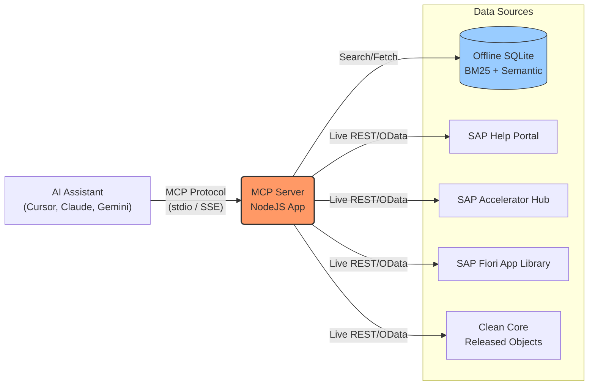
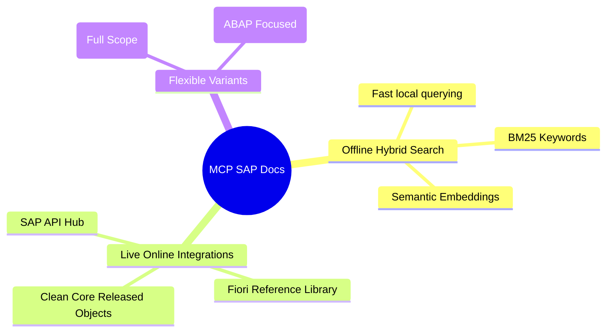

# MCP SAP Docs

A powerful Model Context Protocol (MCP) Server connecting AI assistants (Claude, Cursor, Gemini IDE) to SAP's vast ecosystem via Hybrid Search & Live APIs.

## 🏗️ Architecture & Flow



## 🚀 Key Features



## 🧰 Available Tools

| Tool | Purpose | Target / Scope |
|------|---------|----------------|
| `search` / `fetch` | General Docs | Offline Docs & SAP Help |
| `sap_community_search` | Troubleshooting | SAP Community Q&A |
| `sap_search_objects` | Clean Core / RAP | Official Released ABAP Objects |
| `abap_feature_matrix` | Syntax Support | ABAP 7.40+ Features |
| `sap_accelerator_hub_*` | Integrations | OData, REST, SOAP APIs |
| `sap_fiori_library_*` | Fiori UI | Standard Fiori Apps & Configs |
| `sap_discovery_center_*`| Cloud Services | BTP Services & Pricing |
| `abap_lint` | Code Quality | Static Analysis (ABAP Variant) |

## 📂 Project Structure

```text
mcp-sap-docs/
├── config/        # Variant configurations (sap-docs.json, abap.json)
├── src/           # TypeScript source code (Tools & Handlers)
├── dist/          # Compiled JS and generated docs.sqlite database
├── sources/       # Raw data from SAP Git Submodules
├── setup.sh       # Auto-setup script (Bash required)
└── manifest-extend.yml # Cloud Foundry deployment descriptor
```

## Prerequisites

Before configuring your client, ensure your local machine meets the following requirements:

1. **Node.js**: Must be installed (minimum version **Node.js v18** or above). Verify by running `node -v` in your terminal.
2. **Network Connectivity**:
   - Outbound HTTPS access to the hosted server: `https://sap-docs-extend-mcp.cfapps.ap21.hana.ondemand.com`
   - Access to `registry.npmjs.org` to fetch `supergateway`. If your machine is behind a corporate firewall/VPN/proxy that blocks npm registry downloads, you **must** use the global installation method (**Option 2** below).
3. **Compatible IDE**: An IDE supporting MCP (e.g. Cursor, Claude Desktop, VS Code, Gemini IDE).

---

## ⚙️ MCP Configuration (Client IDE)

To ensure **100% stability across all devices** (preventing version mismatch or Node.js v18 compatibility issues), use one of the two configurations below:

### Option 1: Lock Version with npx (Recommended & Easiest)

Locks the `supergateway` version to `2.0.0` and uses the correct `--sse` argument to connect. This works on all devices with Node.js v18 or above.

Add this block to your `mcpServers` configuration file (e.g., `claude_desktop_config.json` or `mcp_config.json`):

```json
{
  "mcpServers": {
    "mcp-sap-docs-btp": {
      "command": "npx",
      "args": [
        "-y",
        "supergateway@2.0.0",
        "--sse",
        "https://sap-docs-extend-mcp.cfapps.ap21.hana.ondemand.com/sse",
        "--header",
        "SAP-API-HUB-KEY: <YOUR_API_KEY_HERE>" 
      ],
      "disabled": false
    }
  }
}
```

### Option 2: Global Installation (Offline & Network-Resilient)

Best for enterprise environments behind corporate firewalls, VPNs, or proxy servers where running `npx` dynamically on every IDE startup might fail or time out.

1. Install `supergateway` globally on your machine once:
   ```bash
   npm install -g supergateway@2.0.0
   ```

2. Update your IDE's `mcpServers` configuration to use the globally installed tool directly:
   ```json
   {
     "mcpServers": {
       "mcp-sap-docs-btp": {
         "command": "supergateway",
         "args": [
           "--sse",
           "https://sap-docs-extend-mcp.cfapps.ap21.hana.ondemand.com/sse",
           "--header",
           "SAP-API-HUB-KEY: <YOUR_API_KEY_HERE>" 
         ],
         "disabled": false
       }
     }
   }
   ```
   *(Note for Windows users: If your IDE cannot locate the global command, use `supergateway.cmd` as the command, or specify the absolute path to your global `npm` prefix).*

*(Note: `SAP-API-HUB-KEY` is **optional**. If omitted, the `sap_accelerator_hub_*` tools will be restricted from fetching API data, but all other tools like Offline Search, Fiori Library, and Clean Core Objects will still work normally.)*

## 🔗 References

- **BTP Deployment Guide**: [mcp_btp_deployment_guide.md](./mcp_btp_deployment_guide.md)
- **Remote Setup**: [REMOTE_SETUP.md](./REMOTE_SETUP.md)
- **Architecture Details**: [docs/ARCHITECTURE.md](./docs/ARCHITECTURE.md)
- **Hybrid Search Algorithm**: [docs/HYBRID-SEARCH.md](./docs/HYBRID-SEARCH.md)
